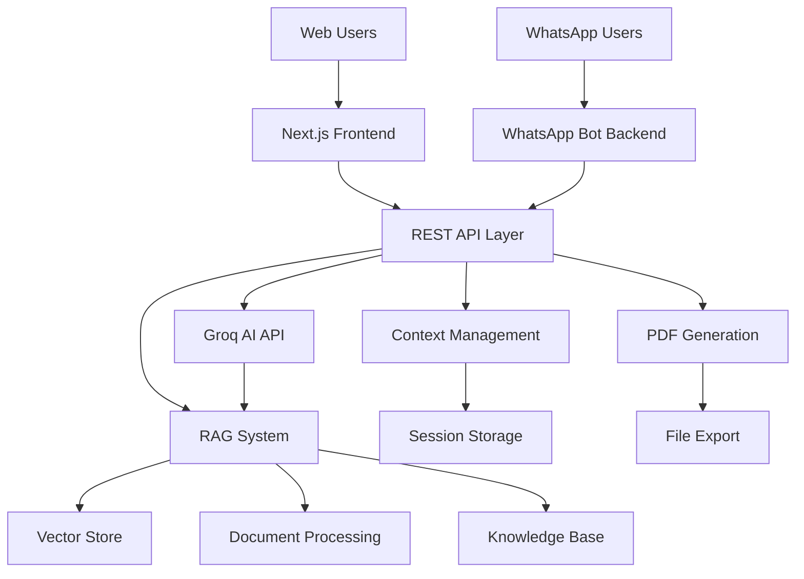

# AI Client Reports

A WhatsApp bot that generates business reports using AI, with a web interface to visualize and manage reports. Now enhanced with RAG (Retrieval-Augmented Generation) for knowledge-based responses.

## What is this?

Basically, you can ask for company analysis both via WhatsApp and through a web interface. The bot uses AI (Groq/LLaMA) enhanced with a RAG system to generate business reports and insights based on your uploaded documents. You can download everything as PDF.

**Why did I build this?** I wanted a quick way to generate company analysis without having to open multiple tabs or applications. WhatsApp is always at hand, and now with RAG, the bot can use your own knowledge base to provide more accurate and contextual responses.

## How it works

- **WhatsApp Bot**: Send "analyze Tesla" and get a complete report enhanced with your knowledge base
- **Web Interface**: More complete version with history, templates, and RAG document management
- **RAG System**: Upload documents to build your own knowledge base that enriches AI responses
- **API**: Connects everything together and makes the magic happen

## Architecture



**Components:**
- **Frontend (Next.js)**: Web interface with React 19, TypeScript, TailwindCSS
- **Backend (Node.js)**: Express server with WhatsApp integration via Baileys
- **AI Layer**: Groq LLaMA 3 70B for intelligent analysis
- **RAG System**: Document processing, embeddings, and vector search for enhanced responses
- **Storage**: In-memory session management (database planned)
- **Export**: PDF generation on client and server

## What you can do

### On WhatsApp
- Chat naturally: "How is Amazon doing financially?"
- Ask for specific analysis: "Do a SWOT analysis of Netflix"
- Context maintained: you can continue the conversation normally
- **RAG-enhanced responses**: The bot uses your uploaded documents to provide more accurate answers

### On the Web
- Generate reports with ready-made templates
- See history of everything that was generated
- Direct chat with AI
- **Document Management**: Upload PDFs, Word docs, text files to build your knowledge base
- **RAG Explorer**: Search through your documents and see how they enhance responses
- Download organized PDFs

### Features
- Support for Portuguese and English
- Conversation memory (10 messages)
- Rate limiting to avoid breaking the API
- Automatically generated PDFs
- **RAG System**: Upload documents (PDF, DOCX, TXT, MD, HTML, JSON) to enhance AI responses
- **Vector Search**: Semantic search through your knowledge base
- **Smart Context**: AI responses are enriched with relevant information from your documents

## Tech Stack

**Backend (Node.js)**
- Express.js for REST API
- @whiskeysockets/baileys for WhatsApp integration
- Groq API (LLaMA 3 70B) for AI
- PDFKit for server-side PDF generation
- **RAG System**: Custom implementation with vector embeddings and semantic search

**Frontend (Next.js)**
- React 19 + TypeScript
- TailwindCSS + HeroUI for UI
- jsPDF for client-side PDFs
- Lucide React for icons

**Why these choices?**
- **Groq**: Faster than OpenAI and cheaper
- **Baileys**: Most stable library for WhatsApp Web
- **Next.js**: SSR and performance out-of-the-box
- **HeroUI**: Beautiful components without reinventing the wheel
- **Custom RAG**: Tailored for business documents and analysis needs

## How to run

**Prerequisites:**
- Node.js 18+
- Groq account (it's free)
- WhatsApp (obviously)

**Step by step:**

1. **Clone the project**
```bash
git clone https://github.com/BraianMendes/ai-client-reports
cd ai-client-reports
```

2. **Install all dependencies**
```bash
npm run install:all
# or manually:
# cd ai-whatsapp-reports-backend && npm install
# cd ../ai-whatsapp-reports-frontend && npm install
```

3. **Backend setup**
```bash
cd ai-whatsapp-reports-backend
cp .env.example .env
# Edit .env with your GROQ_API_KEY
```

4. **Frontend setup**
```bash
cd ai-whatsapp-reports-frontend
cp .env.local.example .env.local
# Edit .env.local with backend URL (usually http://localhost:3001)
```

5. **Start development**
```bash
# From project root
npm run dev
# This starts both backend and frontend
```

6. **Connect WhatsApp**
- A QR code will appear in the backend terminal
- Scan it with your WhatsApp
- Done!

7. **Test the system**
- Web: http://localhost:3000
- WhatsApp: send any message to the connected number
- **RAG**: Go to http://localhost:3000/rag to upload documents and test knowledge-based responses

## How to use

### Via WhatsApp
```
You: analyze Tesla
Bot: [complete report about Tesla, enhanced with your uploaded documents]

You: what about their marketing?
Bot: [marketing-focused analysis, maintaining context and using RAG knowledge]
```

### Via Web
1. Go to http://localhost:3000
2. **Upload documents**: Visit /rag to build your knowledge base
3. Click "Generate Report" or use the Chat
4. Choose template or write freely
5. Download PDF

### RAG System
1. **Upload documents**: Go to http://localhost:3000/rag
2. **Upload files**: PDF, DOCX, TXT, MD, HTML, JSON supported
3. **Test search**: Use the search feature to see how documents are indexed
4. **Enhanced chat**: All chat responses now use your knowledge base automatically

### API (if you want to integrate)
```bash
# Regular analysis
curl -X POST http://localhost:3001/analyze \
  -H "Content-Type: application/json" \
  -d '{"message": "analyze Apple", "userId": "test"}'

# RAG endpoints
curl -X GET http://localhost:3001/rag/stats
curl -X POST http://localhost:3001/rag/search \
  -H "Content-Type: application/json" \
  -d '{"query": "financial performance", "topK": 5}'
```

## Configuration

**Backend variables (.env):**
```env
GROQ_API_KEY=your_key_here             # Required
GROQ_MODEL=llama3-70b-8192             # Optional
PORT=3001                              # Optional
```

**Frontend variables (.env.local):**
```env
NEXT_PUBLIC_API_URL=http://localhost:3001  # Backend URL
```

**Security settings** (in `backend/utils/conversationContext.js`):
- Session timeout: 30 minutes
- Rate limit: 10 messages per minute
- Context: maximum 10 messages stored
- Message size: 2-500 characters (WhatsApp), 2-2000 (Web)

**RAG settings**:
- Supported file types: PDF, DOCX, TXT, MD, HTML, JSON
- Max file size: 10MB
- Vector similarity threshold: 0.4 (configurable)
- Context length: 1500 characters per relevant document

## Current limitations

**Things that don't work well yet:**
- Sessions are lost when server restarts (no database yet)
- Only works with one WhatsApp number at a time
- PDFs could be prettier
- RAG system is in-memory only (vectors lost on restart)
- Performance drops with many simultaneous users
- Document processing is synchronous (can be slow for large files)

**External dependencies:**
- Groq API (if it goes down, the bot stops)
- WhatsApp Web (needs stable connection)
- Internet (obvious, but good to remember)

## Next steps

**In development:**
- [ ] Database for persistent history and RAG vectors
- [ ] Improve PDF design
- [ ] Async document processing with progress indicators
- [ ] More file format support (images, audio transcription)
- [ ] More varied templates

**If I have time:**
- [ ] Support for more languages
- [ ] Slack/Discord integration
- [ ] Dashboard with statistics
- [ ] Public API for third parties
- [ ] Advanced RAG features (document summarization, auto-tagging)

## Contributing

If you want to help:
1. Fork it
2. Create a branch: `git checkout -b my-feature`
3. Commit: `git commit -m "feat: amazing new feature"`
4. Open PR

**Areas that need help:**
- Frontend: improve UX/UI, especially RAG interface
- Backend: optimization and database integration
- RAG: better document processing and vector storage
- DevOps: containerization and deployment
- Docs: more examples and tutorials

## Project structure

```
ai-client-reports/
├── ai-whatsapp-reports-backend/     # API + WhatsApp Bot
│   ├── index.js                    # Express server
│   ├── bot.js                      # Bot logic
│   ├── utils/                      # Helper functions
│   │   ├── ragService.js           # RAG system logic
│   │   ├── vectorStore.js          # Vector storage
│   │   ├── embeddings.js           # Text embeddings
│   │   └── documentProcessor.js    # Document parsing
│   └── scripts/                    # Utility scripts
├── ai-whatsapp-reports-frontend/    # Web interface
│   ├── src/app/                    # Pages (App Router)
│   │   ├── rag/                    # RAG management page
│   │   └── chat/                   # Enhanced chat with RAG
│   ├── src/components/             # React components
│   │   └── RAGExplorer.tsx         # RAG interface component
│   └── public/                     # Static assets
├── scripts/                        # Development utilities
└── README.md                       # This file
```

## FAQ

**Q: Can I use this with my business number?**
A: Yes, but test it first. WhatsApp might disconnect if it detects automated usage.

**Q: How much does the Groq API cost?**
A: There's a generous free tier. After that it's about $0.59/1M tokens.

**Q: Does it work offline?**
A: No, it needs internet for AI and WhatsApp Web.

**Q: Can I customize the reports?**
A: Yes, by editing prompts in the code or creating templates on the web.

**Q: What file formats does RAG support?**
A: PDF, DOCX, TXT, MD, HTML, and JSON files up to 10MB each.

**Q: How does RAG enhance the responses?**
A: When you ask a question, the system searches through your uploaded documents for relevant information and includes it in the AI's context, making responses more accurate and specific to your knowledge base.

**Q: Are my documents stored securely?**
A: Currently documents are processed and stored in memory only. For production use, implement proper database storage with encryption.

## Available Scripts

The project includes several utility scripts in the `scripts/` folder:

- `npm run dev` - Start both frontend and backend in development mode
- `npm run install:all` - Install dependencies for both projects
- `npm run menu` - Open interactive menu with all options
- `npm run test:rag` - Test RAG functionality
- `scripts/start-dev.bat` - Windows batch script for development setup
- `scripts/start-prod.bat` - Windows batch script for production

Run `npm run menu` for an interactive selection of all available commands.

## License

ISC - basically do whatever you want, just don't sue me if something breaks.

---

**Made with ☕ and some sleepless nights**

*If you found this useful, leave a ⭐ on the repo!*
