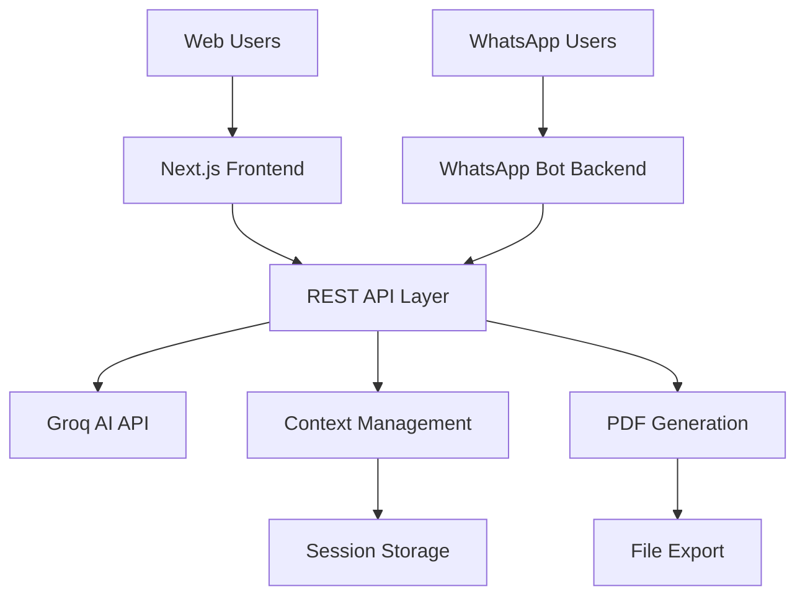

# 🤖 AI Client Reports - Complete Platform

> **Comprehensive AI-powered business reporting platform with WhatsApp integration and modern web interface**

A full-stack solution that combines an intelligent WhatsApp bot, powerful REST APIs, and a sleek web frontend to provide automated business analysis and report generation using cutting-edge AI technology.

## 📋 Table of Contents

- [🎯 Project Overview](#-project-overview)
- [🏗️ Architecture](#️-architecture)
- [✨ Features](#-features)
- [🛠️ Technologies](#️-technologies)
- [🚀 Complete Installation](#-complete-installation)
- [⚙️ Configuration](#️-configuration)
- [🔄 How to Use](#-how-to-use)
- [📡 API Integration](#-api-integration)
- [🔒 Security & Architecture](#-security--architecture)
- [📊 System Limitations](#-system-limitations)
- [🔮 Future Roadmap](#-future-roadmap)
- [👨‍💻 Contributing](#-contributing)
- [📄 License](#-license)

## 🎯 Project Overview

The **AI Client Reports Platform** is a comprehensive business intelligence solution that revolutionizes how companies generate, access, and interact with business analysis reports. The platform combines three core components:

### 🌟 **Core Components**

1. **🤖 WhatsApp Bot Backend** - Intelligent conversational AI that generates business reports through natural WhatsApp conversations
2. **🌐 Modern Web Frontend** - Sleek, responsive web application for report generation, management, and export
3. **🔄 Unified API Layer** - Robust REST API that connects both interfaces with advanced AI processing

### 🎪 **What Makes This Platform Unique**

- **Multi-Channel Access**: Generate reports via WhatsApp OR web interface
- **Contextual AI**: Maintains conversation memory across all interactions
- **Real-time Sync**: Reports generated on WhatsApp appear in the web interface
- **Export Capabilities**: PDF generation, sharing, and archiving
- **Template System**: Pre-built analysis templates (SWOT, Financial, Market)
- **Multi-language Support**: English and Portuguese report generation
- **Enterprise Security**: Rate limiting, access control, and message validation

## 🏗️ Architecture



### **Component Breakdown**

- **Frontend (Next.js)**: Modern web interface with React 19, TypeScript, TailwindCSS
- **Backend (Node.js)**: Express server with WhatsApp integration via Baileys
- **AI Layer**: Groq LLaMA 3 70B model for intelligent analysis
- **Storage**: In-memory session management with planned database integration
- **Export**: Client-side and server-side PDF generation

## ✨ Features

### 🤖 **WhatsApp Bot Capabilities**
- ✅ **QR Code Connection** - Simple WhatsApp Web integration
- ✅ **Natural Conversations** - Human-like business analysis discussions
- ✅ **Media Handling** - Friendly responses to images/documents
- ✅ **Context Preservation** - 10-message memory per session
- ✅ **Auto-Detection** - Company names, topics, and conversation types
- ✅ **Timeout Management** - 30-minute session cleanup

### 🌐 **Web Interface Features**
- ✅ **AI Report Generation** - Interactive form with templates
- ✅ **Report History** - Browse, search, and manage past reports
- ✅ **AI Chat Interface** - Direct conversation with AI assistant
- ✅ **PDF Export** - Professional report downloading
- ✅ **Responsive Design** - Desktop and mobile optimization
- ✅ **Dark Theme** - Modern, minimalist UI design
- ✅ **Multi-language** - English and Portuguese support

### 🔄 **Unified Platform Benefits**
- ✅ **Cross-Platform Sync** - Reports accessible from both channels
- ✅ **Context Sharing** - Conversation history between interfaces
- ✅ **Flexible Access** - Use WhatsApp on-the-go, web for detailed work
- ✅ **Export Options** - Multiple format support
- ✅ **Template Library** - Pre-built analysis frameworks

## 🛠️ Technologies

### **Backend Technologies**

#### **Core Framework**
- **Node.js 16+**: Server-side JavaScript runtime
  - *Why?* Excellent ecosystem, npm packages, and real-time capabilities
- **Express.js**: Web application framework
  - *Why?* Lightweight, flexible, and extensive middleware support

#### **WhatsApp Integration**
- **@whiskeysockets/baileys**: WhatsApp Web API library
  - *Why?* Most stable and feature-complete WhatsApp bot library
- **qrcode-terminal**: QR code generation for terminal
  - *Why?* Simple connection process without external dependencies

#### **AI & Processing**
- **Groq API**: LLaMA 3 70B model access
  - *Why?* Fastest inference speeds and high-quality responses
- **Axios**: HTTP client for API communication
  - *Why?* Promise-based, interceptors, and request/response transformation

#### **Utilities**
- **PDFKit**: Server-side PDF generation
  - *Why?* Programmatic PDF creation with full control
- **dotenv**: Environment variable management
  - *Why?* Secure configuration management
- **CORS**: Cross-origin resource sharing
  - *Why?* Enable frontend-backend communication

### **Frontend Technologies**

#### **Core Framework**
- **Next.js 15.3.4**: React framework with App Router
  - *Why?* Server-side rendering, optimization, and excellent developer experience
- **React 19**: Latest React version
  - *Why?* Concurrent features, improved performance, and modern hooks
- **TypeScript 5**: Type-safe development
  - *Why?* Better code quality, IDE support, and runtime error prevention

#### **UI & Styling**
- **Tailwind CSS 4**: Utility-first CSS framework
  - *Why?* Rapid development, consistent design system, and minimal CSS
- **HeroUI**: Modern React component library
  - *Why?* Beautiful, accessible components with consistent design
- **Framer Motion**: Animation library
  - *Why?* Smooth, performant animations and micro-interactions

#### **Functionality**
- **jsPDF**: Client-side PDF generation
  - *Why?* Browser-based PDF creation without server round-trips
- **Lucide React**: Icon library
  - *Why?* Consistent, customizable icons with TypeScript support
- **Axios**: HTTP client for API calls
  - *Why?* Same library as backend for consistency

#### **Development Tools**
- **ESLint**: Code linting and quality
- **PostCSS**: CSS processing and optimization
- **Turbopack**: Next.js bundler for faster development

## 🚀 Complete Installation

### **Prerequisites**
- **Node.js 18+** installed on your machine
- **npm, yarn, pnpm, or bun** package manager
- **Groq API Account** for AI functionality
- **WhatsApp Account** for bot integration

### **1. Clone the Repository**
```bash
git clone <repository-url>
cd ai-client-reports
```

### **2. Backend Setup**

```bash
# Navigate to backend
cd ai-whatsapp-reports-backend

# Install dependencies
npm install

# Configure environment variables
cp .env.example .env
```

Edit the backend `.env` file:
```env
GROQ_API_KEY=gsk_your_groq_api_key_here
GROQ_MODEL=llama3-70b-8192
GROQ_URL=https://api.groq.com/openai/v1/chat/completions
PORT=3001
ANALYZE_API_URL=http://localhost:3001/analyze
```

### **3. Frontend Setup**

```bash
# Navigate to frontend (from project root)
cd ai-whatsapp-reports-frontend

# Install dependencies
npm install

# Configure environment variables
cp .env.example .env.local
```

Edit the frontend `.env.local` file:
```env
NEXT_PUBLIC_API_URL=http://localhost:3001
```

### **4. Start the Complete Platform**

**Terminal 1 - Backend:**
```bash
cd ai-whatsapp-reports-backend
npm start
```

**Terminal 2 - Frontend:**
```bash
cd ai-whatsapp-reports-frontend
npm run dev
```

### **5. Connect WhatsApp**
1. Check Terminal 1 for the QR code
2. Scan with your WhatsApp mobile app
3. Wait for "WhatsApp connected!" message

### **6. Access the Platform**
- **Web Interface**: http://localhost:3000
- **API Documentation**: http://localhost:3001/api-docs
- **WhatsApp**: Send messages to your connected number

## ⚙️ Configuration

### **Backend Configuration**

| Variable | Description | Default | Required |
|----------|-------------|---------|----------|
| `GROQ_API_KEY` | Groq API access key | - | ✅ |
| `GROQ_MODEL` | AI model identifier | `llama3-70b-8192` | ❌ |
| `GROQ_URL` | Groq API endpoint | `https://api.groq.com/openai/v1/chat/completions` | ❌ |
| `PORT` | Backend server port | `3001` | ❌ |
| `ANALYZE_API_URL` | Internal API URL | `http://localhost:3001/analyze` | ❌ |

### **Frontend Configuration**

| Variable | Description | Default | Required |
|----------|-------------|---------|----------|
| `NEXT_PUBLIC_API_URL` | Backend API URL | `http://localhost:3001` | ✅ |

### **Security Settings**

Located in `backend/utils/conversationContext.js`:

```javascript
SESSION_TIMEOUT = 30 * 60 * 1000;          // 30 minutes
MAX_CONTEXT_MESSAGES = 10;                 // 10 messages
RATE_LIMIT_WINDOW = 60 * 1000;            // 1 minute  
RATE_LIMIT_MAX_REQUESTS = 10;             // 10 messages/minute
MIN_MESSAGE_LENGTH = 2;                    // Minimum 2 characters
MAX_MESSAGE_LENGTH = 500;                  // Maximum 500 characters (Bot)
MAX_MESSAGE_LENGTH_API = 2000;             // Maximum 2000 characters (API)
```

## 🔄 How to Use

### **Via Web Interface**

1. **Access the Platform**
   - Navigate to http://localhost:3000
   - Choose from three main options: Reports, History, or Chat

2. **Generate Reports**
   - Click "Generate Report"
   - Select a template (SWOT, Financial, Market Analysis) or create custom
   - Choose output language (English/Portuguese)
   - Submit your prompt
   - Download PDF when complete

3. **Browse History**
   - View all previously generated reports
   - Search and filter by date or content
   - Re-download or delete reports

4. **AI Chat**
   - Interactive conversation with AI
   - Ask questions and get immediate insights
   - Context maintained throughout session

### **Via WhatsApp**

1. **Start Conversation**
   ```
   Analyze Tesla's business model
   ```

2. **Continue with Context**
   ```
   What about their marketing strategy?
   How can I apply this to my startup?
   ```

3. **Ask Specific Questions**
   ```
   Create a SWOT analysis for Amazon
   Financial advice for small businesses
   ```

### **API Usage**

```bash
# Generate analysis
curl -X POST http://localhost:3001/analyze \
  -H "Content-Type: application/json" \
  -d '{"message": "Analyze Netflix business model", "userId": "web-user-123"}'

# Get session info
curl http://localhost:3001/session/web-user-123

# Reset session
curl -X DELETE http://localhost:3001/session/web-user-123
```

## 📡 API Integration

### **Core Endpoints**

#### **POST** `/analyze`
Generate business analysis with AI.

**Request:**
```json
{
  "message": "Analyze Apple's innovation strategy",
  "userId": "unique-user-identifier"
}
```

**Response:**
```json
{
  "analysis": "## BUSINESS ANALYSIS REPORT\n\n**COMPANY:** Apple Inc...",
  "context": {
    "companyFocus": "Apple",
    "currentTopic": "innovation",
    "conversationType": "report",
    "messageCount": 1
  }
}
```

#### **GET** `/session/{userId}`
Retrieve user session statistics.

**Response:**
```json
{
  "messageCount": 5,
  "sessionDuration": 900000,
  "reportCount": 3,
  "currentTopic": "strategy",
  "companyFocus": "Apple",
  "lastActivity": "2025-06-26T10:30:00Z"
}
```

#### **DELETE** `/session/{userId}`
Clear user session and context.

### **Admin Endpoints**

#### **POST** `/admin/allow-user`
Add user to whitelist (if access control enabled).

#### **GET** `/admin/allowed-users`
List all whitelisted users.

## 🔒 Security & Architecture

### **Security Measures**

#### **Rate Limiting**
- **10 messages per minute** per user across all channels
- **Automatic blocking** for spam prevention
- **Progressive timeouts** for repeated violations

#### **Access Control**
- **Optional whitelist** system for controlled access
- **User validation** across WhatsApp and web interfaces
- **Session isolation** between different users

#### **Message Validation**
- **Content filtering** for malicious input
- **Size limits** (2-500 chars for WhatsApp, 2-2000 for web)
- **Encoding normalization** for consistent processing
- **Media handling** with friendly error messages

#### **Data Protection**
- **In-memory storage** (no persistent data currently)
- **Session timeouts** for automatic cleanup
- **Secure environment variables** for API keys
- **CORS configuration** for frontend security

### **Architecture Benefits**

- **Stateless Design**: Easy horizontal scaling
- **Microservice Ready**: Clear separation of concerns
- **API-First**: Frontend and WhatsApp bot use same endpoints
- **Modular Components**: Easy to maintain and extend

## 📊 System Limitations

### **Current Technical Limitations**

#### **Storage & Persistence**
- **In-memory sessions**: Lost on server restart
- **No database**: Limited historical data retention
- **File storage**: Local PDF generation only

#### **AI & Processing**
- **Single AI provider**: Dependent on Groq API availability
- **Context window**: Limited to 10 messages per session
- **Language support**: Optimized for English and Portuguese only
- **Processing time**: Dependent on AI API response times

#### **WhatsApp Integration**
- **WhatsApp Web dependency**: Requires stable internet connection
- **QR code requirement**: Manual connection process
- **Text-only processing**: Media files not directly analyzed
- **Single device**: One WhatsApp connection per instance

#### **Web Interface**
- **Client-side PDF**: Limited formatting options
- **Real-time sync**: Requires manual refresh for WhatsApp updates
- **Session management**: Browser-based session storage

### **Functional Limitations**

- **Concurrent users**: Performance degrades with high user count
- **Report complexity**: Limited by AI model context window
- **Media processing**: Images and documents not directly analyzed
- **Offline functionality**: Requires internet connection for all features

## 🔮 Future Roadmap

### **Phase 1: Infrastructure & Persistence (Q3 2025)**

#### **Database Integration**
- [ ] **PostgreSQL/MongoDB**: Persistent session and report storage
- [ ] **Redis Cache**: Distributed session management
- [ ] **File Storage**: AWS S3/Local storage for PDF archives
- [ ] **Backup System**: Automated data backup and recovery

#### **Enhanced Security**
- [ ] **JWT Authentication**: Secure token-based access
- [ ] **Rate Limiting**: Redis-based distributed rate limiting
- [ ] **Encryption**: End-to-end message encryption
- [ ] **Audit Logging**: Comprehensive activity tracking

### **Phase 2: Feature Expansion (Q4 2025)**

#### **AI Capabilities**
- [ ] **Multi-Model Support**: OpenAI GPT-4, Claude, local models
- [ ] **Image Analysis**: OCR and visual content processing
- [ ] **Document Processing**: PDF, Word, Excel file analysis
- [ ] **Sentiment Analysis**: Emotional tone detection
- [ ] **Language Expansion**: Spanish, French, German support

#### **Platform Features**
- [ ] **Real-time Sync**: WebSocket connections for live updates
- [ ] **Collaboration**: Team workspaces and shared reports
- [ ] **Template Builder**: Custom analysis template creation
- [ ] **Report Scheduling**: Automated periodic report generation
- [ ] **Webhook Integration**: External system notifications

### **Phase 3: Enterprise Features (Q1 2026)**

#### **Business Intelligence**
- [ ] **Analytics Dashboard**: Usage statistics and insights
- [ ] **Visual Reports**: Charts, graphs, and data visualizations
- [ ] **Comparative Analysis**: Historical report comparisons
- [ ] **Export Formats**: Excel, PowerPoint, Word exports
- [ ] **API Marketplace**: Third-party integrations

#### **Platform Extensions**
- [ ] **Mobile Apps**: Native iOS and Android applications
- [ ] **Progressive Web App**: Offline functionality
- [ ] **Voice Interface**: Speech-to-text report generation
- [ ] **Video Analysis**: YouTube, meeting recording processing
- [ ] **Social Media Integration**: Twitter, LinkedIn analysis

### **Phase 4: Advanced AI & Automation (Q2 2026)**

#### **Intelligent Automation**
- [ ] **Auto-categorization**: Smart report classification
- [ ] **Predictive Analytics**: Trend prediction and forecasting
- [ ] **Recommendation Engine**: Personalized analysis suggestions
- [ ] **Smart Alerts**: Proactive business insights
- [ ] **Custom AI Models**: Industry-specific fine-tuned models

#### **Enterprise Integration**
- [ ] **CRM Integration**: Salesforce, HubSpot connections
- [ ] **ERP Systems**: SAP, Oracle integration
- [ ] **BI Tools**: Power BI, Tableau connectors
- [ ] **Slack/Teams Bots**: Enterprise messaging platform integration
- [ ] **API Gateway**: Advanced API management and monetization

### **Long-term Vision (2027+)**

#### **Platform Evolution**
- [ ] **AI Agent Network**: Specialized AI agents for different industries
- [ ] **Marketplace Platform**: Third-party analysis providers
- [ ] **White-label Solutions**: Customizable platform licensing
- [ ] **Industry Verticals**: Healthcare, finance, retail specializations
- [ ] **Global Expansion**: Multi-region deployment and compliance

## 👨‍💻 Contributing

### **How to Contribute**

1. **Fork the Repository**
   ```bash
   git fork https://github.com/BraianMendes/ai-client-reports
   ```

2. **Create Feature Branch**
   ```bash
   git checkout -b feature/amazing-new-feature
   ```

3. **Make Changes**
   - Follow existing code style and patterns
   - Add tests for new functionality
   - Update documentation as needed

4. **Commit Changes**
   ```bash
   git commit -m "feat: add amazing new feature"
   ```

5. **Push and Create PR**
   ```bash
   git push origin feature/amazing-new-feature
   ```

### **Development Guidelines**

#### **Code Standards**
- **ESLint**: Follow configured linting rules
- **TypeScript**: Use type safety in frontend code
- **Comments**: Document complex logic and business rules
- **Testing**: Write unit tests for new features
- **Error Handling**: Implement comprehensive error management

#### **Project Structure**
```
ai-client-reports/
├── README.md                           # This file
├── ai-whatsapp-reports-backend/        # Node.js backend
│   ├── index.js                       # Express server
│   ├── bot.js                         # WhatsApp bot logic
│   ├── utils/                         # Utility functions
│   ├── docs/                          # Backend documentation
│   └── package.json                   # Backend dependencies
├── ai-whatsapp-reports-frontend/       # Next.js frontend
│   ├── src/                           # Source code
│   │   ├── app/                       # App Router pages
│   │   ├── components/                # React components
│   │   ├── hooks/                     # Custom hooks
│   │   └── utils/                     # Utility functions
│   ├── public/                        # Static assets
│   └── package.json                   # Frontend dependencies
└── docs/                              # Platform documentation
```

#### **Contribution Areas**

**Backend Improvements**
- Database integration and migrations
- Additional AI model support
- Enhanced security features
- Performance optimizations
- API endpoint expansion

**Frontend Enhancements**
- UI/UX improvements
- New component development
- Performance optimizations
- Accessibility improvements
- Mobile responsiveness

**Platform Features**
- Cross-platform synchronization
- Export format expansion
- Template system enhancements
- Multi-language support
- Integration capabilities

## 📄 License

This project is licensed under the **ISC License** - see the [LICENSE](LICENSE) file for details.

### **License Summary**
- ✅ **Commercial Use**: Use in commercial projects
- ✅ **Modification**: Modify and adapt the code
- ✅ **Distribution**: Distribute original or modified versions
- ✅ **Private Use**: Use for private/internal projects
- ❌ **Liability**: No warranty or liability provided
- ❌ **Trademark Use**: No trademark rights granted

---

## 🚀 Quick Start Guide

### **For Developers**
```bash
# 1. Clone and setup
git clone <repository-url>
cd ai-client-reports

# 2. Backend setup
cd ai-whatsapp-reports-backend
npm install
cp .env.example .env
# Edit .env with your GROQ_API_KEY
npm start

# 3. Frontend setup (new terminal)
cd ../ai-whatsapp-reports-frontend
npm install
npm run dev

# 4. Access platform
# Web: http://localhost:3000
# Scan QR code for WhatsApp integration
```

### **For Business Users**
1. **Web Access**: Navigate to the hosted web interface
2. **WhatsApp Setup**: Scan QR code with your WhatsApp
3. **Start Analyzing**: Send "Analyze [Company Name]" via WhatsApp or use web interface
4. **Export Reports**: Download PDF reports for sharing and archiving

---

## 📞 Support & Contact

- **Issues**: [GitHub Issues](https://github.com/BraianMendes/ai-client-reports/issues)
- **Discussions**: [GitHub Discussions](https://github.com/BraianMendes/ai-client-reports/discussions)
- **Documentation**: [Project Wiki](https://github.com/BraianMendes/ai-client-reports/wiki)
- **Email**: support@ai-client-reports.com

---

**Built with ❤️ using Next.js, Node.js, and AI**

> **Note**: This platform is actively developed and maintained. For the latest updates, feature requests, or bug reports, please visit our [GitHub repository](https://github.com/BraianMendes/ai-client-reports).
