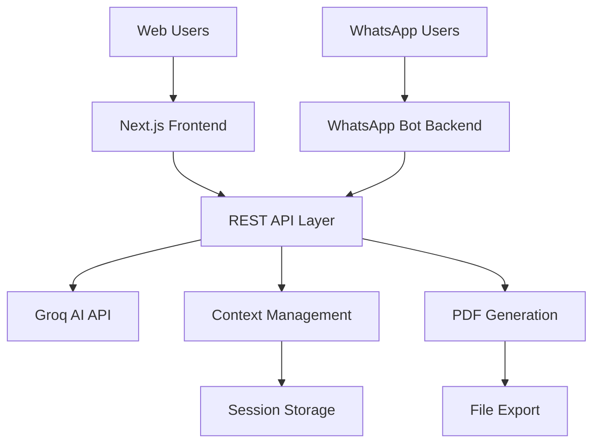

# AI Client Reports

Um bot do WhatsApp que gera relatórios de negócios usando IA, com uma interface web para visualizar e gerenciar os relatórios.

## O que é isso?

Basicamente, você pode pedir análises de empresas tanto via WhatsApp quanto por uma interface web. O bot usa IA (Groq/LLaMA) para gerar relatórios de negócios e você pode baixar em PDF.

**Por que fiz isso?** Queria uma forma rápida de gerar análises de empresas sem ter que abrir várias abas ou aplicativos. O WhatsApp tá sempre na mão, então por que não usar?

## Como funciona

- **WhatsApp Bot**: Manda "analisa a Tesla" e recebe um relatório completo
- **Interface Web**: Versão mais completa com histórico e templates
- **API**: Liga tudo junto e faz a mágica acontecer

## Arquitetura



**Componentes:**
- **Frontend (Next.js)**: Interface web com React 19, TypeScript, TailwindCSS
- **Backend (Node.js)**: Servidor Express com integração WhatsApp via Baileys
- **AI Layer**: Groq LLaMA 3 70B para análises inteligentes
- **Storage**: Gerenciamento de sessão em memória (banco planejado)
- **Export**: Geração de PDF no cliente e servidor

## O que dá pra fazer

### No WhatsApp
- Conversar naturalmente: "Como está a Amazon financeiramente?"
- Pedir análises específicas: "Faz uma análise SWOT da Netflix"
- Contexto mantido: pode continuar a conversa normalmente

### Na Web
- Gerar relatórios com templates prontos
- Ver histórico de tudo que já foi gerado
- Chat direto com a IA
- Baixar PDFs organizados

### Funcionalidades
- Suporte a português e inglês
- Memória de conversa (10 mensagens)
- Rate limiting pra não quebrar a API
- PDFs gerados automaticamente

## Stack Técnico

**Backend (Node.js)**
- Express.js para a API REST
- @whiskeysockets/baileys para integração WhatsApp
- Groq API (LLaMA 3 70B) para IA
- PDFKit para gerar PDFs no servidor

**Frontend (Next.js)**
- React 19 + TypeScript
- TailwindCSS + HeroUI para UI
- jsPDF para PDFs no cliente
- Lucide React para ícones

**Por que essas escolhas?**
- **Groq**: Mais rápido que OpenAI e mais barato
- **Baileys**: Biblioteca mais estável para WhatsApp Web
- **Next.js**: SSR e performance out-of-the-box
- **HeroUI**: Componentes bonitos sem reinventar a roda

## Como rodar

**Pré-requisitos:**
- Node.js 18+
- Conta na Groq (é gratuita)
- WhatsApp (óbvio)

**Passo a passo:**

1. **Clone o projeto**
```bash
git clone https://github.com/BraianMendes/ai-client-reports
cd ai-client-reports
```

2. **Backend**
```bash
cd ai-whatsapp-reports-backend
npm install
cp .env.example .env
# Edita o .env com sua GROQ_API_KEY
npm start
```

3. **Frontend** (novo terminal)
```bash
cd ai-whatsapp-reports-frontend
npm install
npm run dev
```

4. **Conectar WhatsApp**
- Vai aparecer um QR code no terminal do backend
- Escaneia com seu WhatsApp
- Pronto!

5. **Testar**
- Web: http://localhost:3000
- WhatsApp: manda qualquer mensagem pro número conectado

## Como usar

### Via WhatsApp
```
Você: analisa a Tesla
Bot: [relatório completo sobre Tesla]

Você: e o marketing deles?
Bot: [análise focada em marketing, mantendo contexto]
```

### Via Web
1. Acessa http://localhost:3000
2. Clica em "Generate Report"
3. Escolhe template ou escreve livre
4. Baixa o PDF

### API (se quiser integrar)
```bash
curl -X POST http://localhost:3001/analyze \
  -H "Content-Type: application/json" \
  -d '{"message": "analisa a Apple", "userId": "test"}'
```

## Configuração

**Variáveis do Backend (.env):**
```env
GROQ_API_KEY=sua_chave_aqui          # Obrigatório
GROQ_MODEL=llama3-70b-8192           # Opcional
PORT=3001                            # Opcional
```

**Variáveis do Frontend (.env.local):**
```env
NEXT_PUBLIC_API_URL=http://localhost:3001  # URL do backend
```

**Configurações de segurança** (em `backend/utils/conversationContext.js`):
- Session timeout: 30 minutos
- Rate limit: 10 mensagens por minuto
- Contexto: máximo 10 mensagens guardadas
- Tamanho da mensagem: 2-500 caracteres (WhatsApp), 2-2000 (Web)

## Limitações atuais

**Coisas que ainda não funcionam bem:**
- Sessões são perdidas quando reinicia o servidor (sem banco de dados ainda)
- Só funciona com um número de WhatsApp por vez
- PDFs poderiam ser mais bonitos
- Não analisa imagens ou documentos enviados
- Performance cai com muitos usuários simultâneos

**Dependências externas:**
- Groq API (se cair, o bot para)
- WhatsApp Web (precisa de conexão estável)
- Internet (óbvio, mas é bom lembrar)

## Próximos passos

**Em desenvolvimento:**
- [ ] Banco de dados para persistir histórico
- [ ] Melhorar design dos PDFs
- [ ] Upload e análise de imagens/documentos
- [ ] Templates mais variados

**Se der tempo:**
- [ ] Suporte a mais idiomas
- [ ] Integração com Slack/Discord
- [ ] Dashboard com estatísticas
- [ ] API para terceiros

## Contribuindo

Se quiser ajudar:
1. Faz um fork
2. Cria uma branch: `git checkout -b minha-feature`
3. Commita: `git commit -m "feat: nova feature incrível"`
4. Abre PR

**Áreas que precisam de ajuda:**
- Frontend: melhorar UX/UI
- Backend: otimização e banco de dados
- DevOps: containerização e deploy
- Docs: mais exemplos e tutoriais

## Estrutura do projeto

```
ai-client-reports/
├── ai-whatsapp-reports-backend/    # API + Bot WhatsApp
│   ├── index.js                   # Servidor Express
│   ├── bot.js                     # Lógica do bot
│   └── utils/                     # Funções auxiliares
├── ai-whatsapp-reports-frontend/   # Interface web
│   ├── src/app/                   # Páginas (App Router)
│   ├── src/components/            # Componentes React
│   └── public/                    # Assets estáticos
└── README.md                      # Este arquivo
```

## FAQ

**P: Posso usar com meu número comercial?**
R: Sim, mas teste primeiro. O WhatsApp pode desconectar se detectar uso automatizado.

**P: Quanto custa a API da Groq?**
R: Tem tier gratuito generoso. Depois é tipo $0.59/1M tokens.

**P: Funciona offline?**
R: Não, precisa de internet para IA e WhatsApp Web.

**P: Posso customizar os relatórios?**
R: Sim, editando os prompts no código ou criando templates na web.

## Licença

ISC - basicamente faz o que quiser, só não me processa se quebrar algo.

---

**Feito com ☕ e algumas noites em claro**

*Se achou útil, deixa uma ⭐ no repo!*
